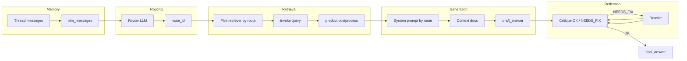

# AI pipeline

LangGraph agent for ecommerce nutrition / shipping / product Q&A.

## Memory flow

- **Checkpoint:** `MemorySaver` keyed by `thread_id` in invoke config.
- **Input:** Caller may pass prior `messages`; `/chat` currently sends empty list (stateless per request unless client replays history).
- **Trim:** `prepare_memory` uses `trim_messages` (last strategy, max tokens from env) before routing.

## Retrieval flow

| Layer | Where | Notes |
|-------|--------|------|
| API default | `dependencies.get_retriever()` | PGVector JSONB collection; falls back to in-memory demo |
| Graph node | `core/graph.retrieve` | Selects retriever dict key from route config |
| Hybrid (lab) | `retrieval.hybrid_retrieve` | BM25 list + vector list → `reciprocal_rank_fusion` |
| Self-Query (lab) | `rag.ipynb` | Metadata filters; complements hybrid for SKU/price filters |

**RRF:** Score = Σ 1/(k + rank); merge ranked lists, return top_n.

## Recommendation flow (product route)

1. Router assigns `route_id=product`.
2. Retriever returns catalog `Document`s (vector similarity).
3. **`postprocess_product_docs`** formats price/weight in metadata for LLM context.
4. **`generate`** uses `product` system prompt.
5. API maps same docs to **`ProductItem`** (`name`, `price_display`, `weight_display`, URLs, snippet).

Product routing is **retrieval + formatting**, not a separate recommender model.

## Tool calling flow

- **Production graph:** No LangChain tools bound; routing uses **structured output** (`RouteDecision` pydantic), not function-calling tools.
- **Reflection:** Plain text critique (`OK` / `NEEDS_FIX`) — heuristic string match, not structured tool.
- **Notebook:** Demonstrates Self-Query retriever, SQL agents, MultiVector parent/child — lab-only unless wired into `retrievers` dict in dependencies.

To add tools: register tools on `ChatOpenAI` / `create_react_agent` in a new graph node; keep retrieval node unchanged.

## Reflection cap

`REFLECTION_MAX_ITERATIONS` (default **3**): loop `reflect` → conditional edge until `final_answer` set or count exceeded.
