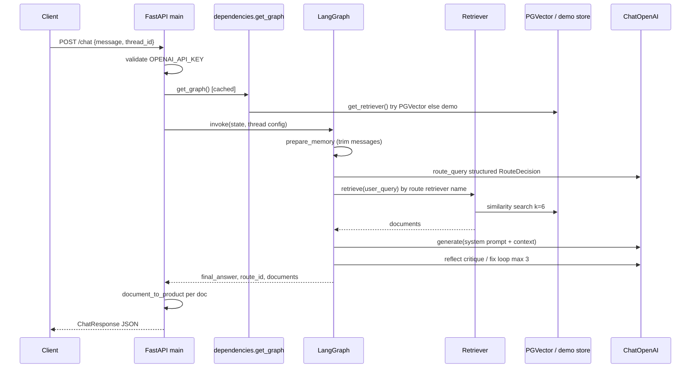

# Request flow

End-to-end lifecycle for **`POST /chat`** (full agentic path).

## Steps

1. **Frontend / client** sends JSON `message` and optional `thread_id` (LangGraph checkpoint key).
2. **`agentic_rag.api.main.chat`** checks API key, loads compiled graph.
3. **Graph input state:** `messages=[]`, `user_query`, `reflection_count=0`.
4. **`prepare_memory`** trims prior thread messages (token budget from `CHAT_TRIM_MAX_TOKENS`).
5. **`route_query`** — small LLM with structured output picks `nutrition | shipping | product | general`.
6. **`retrieve`** — resolves `retriever` name from `config/routes.yaml` (or defaults); `product` route runs `postprocess_product_docs`.
7. **`generate`** — route-specific system prompt from `config/prompts.yaml` + top document context.
8. **`reflect`** — up to `REFLECTION_MAX_ITERATIONS` (default 3): critique → optional rewrite until OK or cap.
9. **`finish`** — sets `final_answer`.
10. **Response mapping** — answer string + `ProductItem` list from retrieved docs metadata.

## `/health`

No LLM call. Returns key flags, PG connection string, route ids, `config_customized`.

## `/chat/stream`

**Not** the graph above: streams raw `ChatOpenAI` tokens for the user message only. Use `/chat` for RAG + routing + reflection.

## Configuration touchpoints

- `.env` / `venv/.env` — `OPENAI_API_KEY`, `PGVECTOR_*`, `REFLECTION_MAX_ITERATIONS`, `CHAT_TRIM_MAX_TOKENS`
- `config/routes.yaml`, `config/prompts.yaml` — optional overrides
